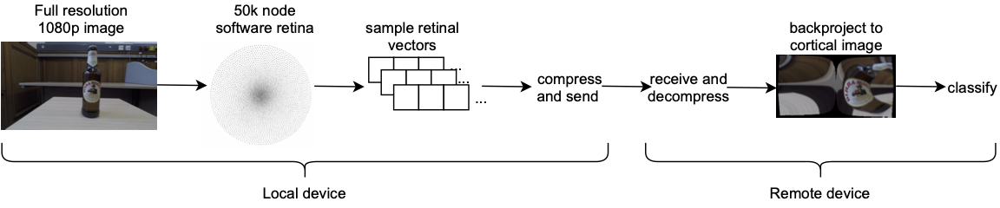

# RetinaSmartCamera

* A Software Retina-Based Smart Camera
* Author: Nicholas Sperry
* Student ID: 2306707s
* Project Supervisor: Dr. Jose Cano Reyes

## Project Description
The Computer Vision for Autonomous Systems lab at the University of Glasgow has been developing foveated vision systems using a software model of the mammalian retina-visual cortex mapping that allows Deep Convolutional Neural Networks (DCNNs) to process large 1080p sized input images in real time, currently with ~x20 data reduction ([link to paper](https://www.frontiersin.org/articles/10.3389/fncel.2019.00036/full)). With the aid of gaze control algorithms, this development has made it possible to build learning-based real-time robot control systems and has great promise for first-person visual processing used in robotics, drones, autonomous vehicles, and more. The software retina implementation was developed by Ozimek and the full repository can be found [here](https://github.com/Pozimek/RetinaVision).

This project built a smart camera by creating a retina pipeline that can compress an input stream. Since the software retina already compresses 1080p images, by further compressing the input stream this smart camera should achieve a higher rate of transmission than a standard video pipeline. Furthermore, this project also collected a small dataset comprising of various objects at different angles and connected the retina pipeline to a Predictive Coding Network (PCN) to further validate the use of cortical images for tasks such as image classification. The final Retina Pipeline diagram can be seen below:

## Project Structure
Here we outline how the project is organised. Each folder displayed here will have its own README file inside explaining its use.
* `timelog.md` The time log kept for this project.
* `plan.md` Week-by-week explanation of the weekly plan.
* `scripts/` Bash scripts used to download the dataset collected for the project, and if needed Ozimek's retina data to run his Retina code.
* `bin/` Retina CUDA library developed by Ozimek, which is needed to run his Retina code with GPU acceleration.
* `retina_data/` Contains the retina data needed to run Ozimek's software retina.
* `models/` Contains pre-trained PyTorch models.
* `notebooks/` The source code of this project. This was done entirely using Jupyter notebooks. A `manual.md` file is also included in this folder explaining how to run the code.

## Requirements
### Google Colab
* The Retina Pipeline and Benchmark notebooks don't work on Colab, as they use PyZMQ. Apart from that, there are no additional requirements to run this on Colab.

### Locally
* You will need to have Anaconda installed in order to run the Jupyter notebooks.
* GPU acceleration for the software retina is only available for Linux and Windows.
* Since this project only uses notebooks, import_ipynb may need to be installed.

      pip install import-ipynb
* If using Anaconda, no other requirements should be needed

## Installation
### Google Colab
This project was developed almost entirely using Google Colab for GPU access. If you plan on doing the same, follow these steps. Please note, however, that the Retina Pipeline and Benchmark notebooks only work locally (i.e. on your computer).
1.  Add this repository to your Google Drive. The easiest way is to manually download this repository and add it directly to your Drive.
2.  The complete dataset is on Google Drive and can be found [here](https://drive.google.com/drive/folders/1UeI7ImDhNBQrdQMNfoMazztBUC9Z8lYT?usp=sharing). 
3.  Go to `Shared with me`->`Frames`->Right click->`Add shortcut to Drive`->Add the dataset folder inside the RetinaSmartCamera directory.

### Locally
If you want to run the Retina Pipeline or benchmark its performance you need to run it locally:
1.  Clone the repository to the desired location

        git clone https://github.com/NicholasSperry/RetinaSmartCamera.git
2.  Navigate to the RetinaSmartCamera directory and run the following script in the command line to download the dataset. Be aware that this file is fairly large (4.7Gb)

        bash scripts/download_dataset.sh
    You can instead also download the dataset from Google Drive directly from [here](https://drive.google.com/drive/folders/1UeI7ImDhNBQrdQMNfoMazztBUC9Z8lYT?usp=sharing) and place it in the RetinaSmartCamera foler.
3.  If needed, run the following script to download the retina data

        bash scripts/download_retina_data.sh
